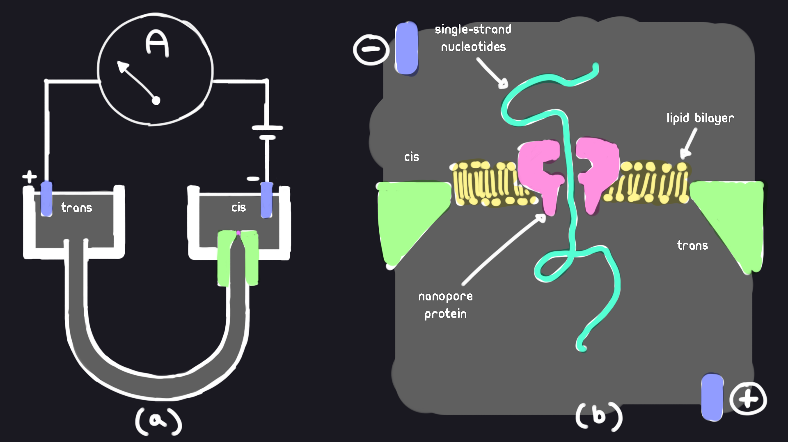
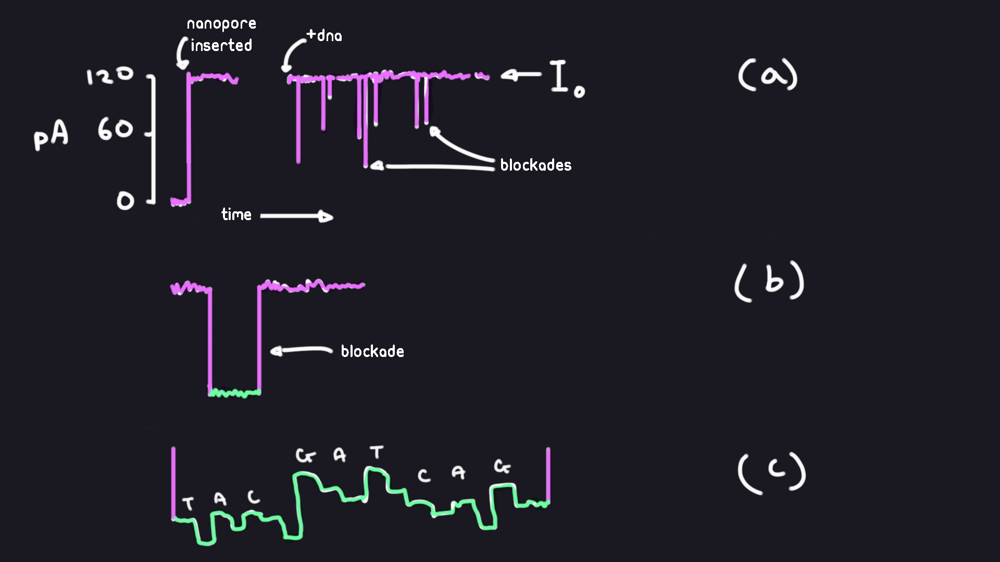

# Nanopore signal data, the SLOW5 format, and you

In this document we provide a brief overview and explanation of nanopore signal data in relation to the SLOW5 file format. We explain what nanopore sequencing is, how we observe and interpret the data, and how SLOW5 fits into all of it.

## What the heck is nanopore?

Nanopore sequencing is a method of capturing the nucleobase sequence of single-stranded DNA (ssDNA) or RNA. 
This specific method involves driving single strand nucleic acids through a nanoscopic protein pore by an applied voltage.
This protein pore is sensitive to the nucleobases being fed through it, and will change in conductivity depending on the nucleobase sequence inside the pore.
By measuring the conductivity of the pore, we store this signal data, and later map it to the base sequence of our ssDNA and RNA.

### The Setup

This figure shows the setup of a nanopore experiment. A DNA strand is drawn through the nanopore by applying voltage. An ion-containing fluid is channeled through a nanopore in the lipid bilayer. The lipid bilayer separates two chambers filled with buffered potassium chloride solutions (KCl). The chambers are named *cis* and *trans* respectively.

(a) The chambers *cis* and *trans* are interconnected via a U-shaped tube. Both chambers are filled with KCl. A voltage bias is applied via the electrodes in each chamber. This bias pulls ions and molecules from the *cis* side to the *trans* side. An ammeter measures the ionic current flowing from the *cis* chamber to the *trans* chamber.

(b) Magnification of the *cis* chamber. The pore in the *cis* side provides the only connection between the two chambers. This is the only point where ions and molecules can move from the *cis* side to the *trans* side.

α-hemolysin is a nanopore protein commonly used in initial experiments. The reason it is so suitable for nanopore sequencing is because it forms a ~1.5nm opening through the impermeable lipid-bilayer. This diameter, whilst much larger than the ions of the KCl solution, allowing for easy passage; can only just fit a single polynucleotide of DNA (~1.2nm), and cannot fit double-stranded DNA (~2.4nm).

In order to accurately map the current to the passage of nucleic acids through the nanopore, we must be able to control the rate at which the strand is being passed through. To solve this, a motor protein (that is unable to fit through the pore), is attached to the end of a ssDNA/RNA strand. Enzymes such as helicases and polymerases have the advantage of traversing though DNA in distinct steps, without needing any additional external source of energy applied. Now when a strand is pulled through the nanopore, it can only go through as fast as the motor protein allows it.

### The Data

Tranditionally, a voltage bias of ~120-180mV is applied between the two sides of the KCl solution. Without the nanopore protein, no ionic current can be measured through the lipid bilayer. Once the protein inserts itself into the bilayer, ions will start flowing through and we see an increase in the measured ionic current. This baseline current it increases to is called the "open channel current". When ssDNA or RNA is added to the *cis* chamber, we begin to see sudden drops in the measured current. We call these transient reductions "blockades". Small modulations in current are sometimes found in these blockades.

(a) Example measured current over time. We see an increase in current once the nanopore is inserted and an ion flow created. The open pore current Io is our baseline current. Most blockades that occur are observed to be the result of polynucleoptide strands being pulled through the pore.

(b) View of a single blockade magnified.

(c) Small modulations in current we might see in a blockade. These modulations are interpreted as corresponding to specific DNA or RNA bases.

## Current Limitations

The nanopore proteins used today have a sensing zone of a minimum 4-5 nucleobases. What this means is that we cannot create a 1-1 mapping of the signal to individual nucleobases. Until a nanopore protein is found that can produce a current reflecting a single nucleobase, we rely on computational algorithms and techniques to decode nanopore signal data.

## Why SLOW5?

Oxford Nanopore Technologies (ONT) is the leading commercial provider of nanopore sequencing. The default FAST5 file format is not optimal for the large amounts of data processing and manipulation required for analyzing and decoding nanopore signal data. Hence, SLOW5 was developed to overcome inherent limitations in the standard FAST5 signal data format that prevent efficient, scalable analysis and cause many headaches for developers.

## Whats inside my SLOW5 file?

SLOW5 stores the metadata and raw signal output of DNA/RNA sequencing runs done through ONT nanopore platforms such as the PromethION, and MinION.

The full specifications of each SLOW5 version can be found here: [slow5 specs](https://hasindu2008.github.io/slow5specs/)